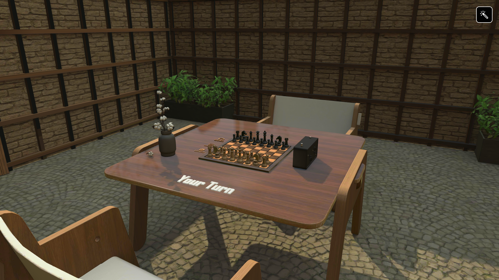
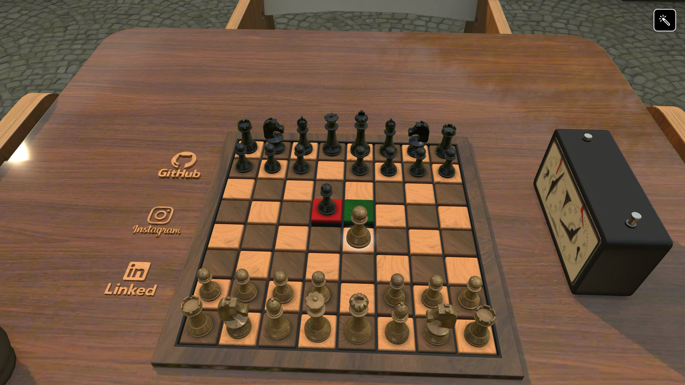
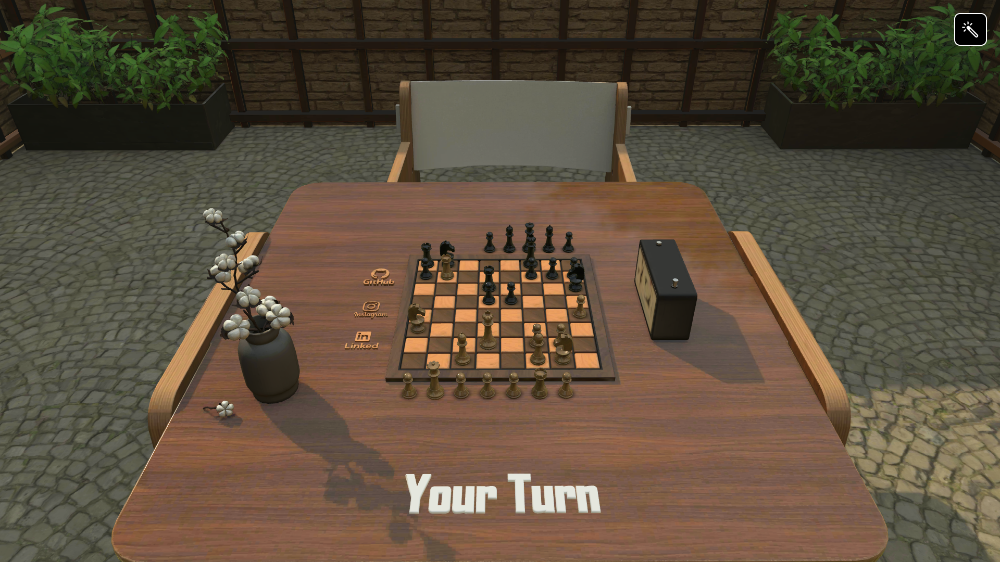
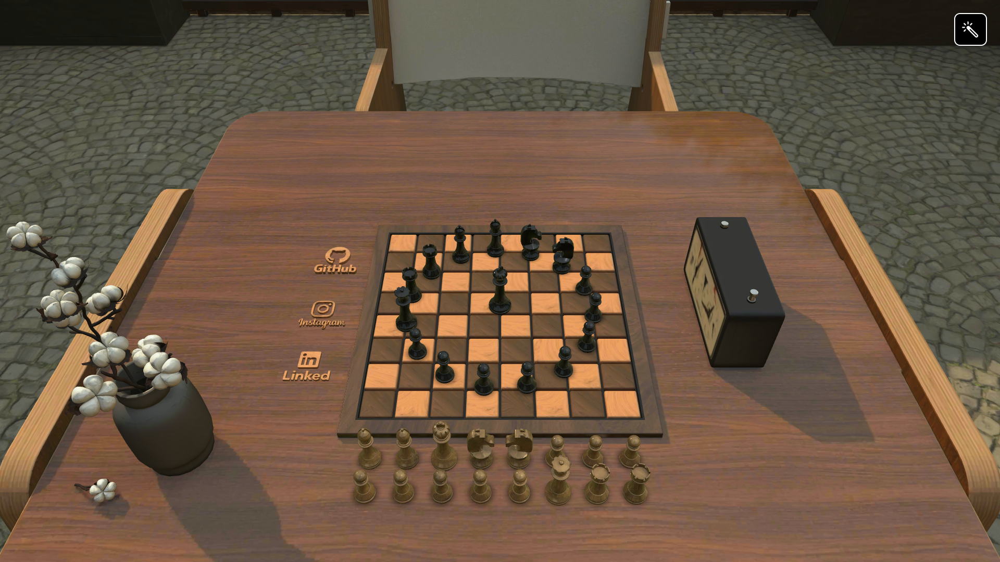

# 3D Chess Game

A fully interactive 3D Chess Game built using **Three.js** and **GSAP**, featuring lifelike 3D chess pieces and smooth animations. The game is powered by **chess.js** for accurate chess rules and move validation, allowing players to enjoy a realistic chess experience directly in the browser.

## Features

- Interactive 3D chessboard and pieces
- Smooth piece animations
- Pawn promotion and piece cloning
- Raycaster-based piece selection and movement
- Chess logic and move validation via chess.js
- Configurable lighting and materials for realistic visuals

## Technologies Used

- [Three.js](https://threejs.org/) – 3D rendering
- [GSAP](https://greensock.com/gsap/) – Animations
- [chess.js](https://github.com/jhlywa/chess.js) – Chess rules and game logic
- HTML, CSS, and JavaScript

## Installation

1. Clone the repository:

```bash
git clone https://github.com/mrabhin03/3D-Chess-Game.git
```

2. Open `index.html` in a browser (no server required, but a local server is recommended for full functionality).

## Usage

* Click on a piece to select it.
* Click on a valid square to move the piece.
* Follow chess rules enforced by the game logic.

## Screenshots
### Environment

### Pieces and Animation

### Automatic Player

### Winner Showcase


## Future Improvements

* Multiplayer support
* AI opponent
* Customizable board and piece themes

## License

This project is licensed under the MIT License.